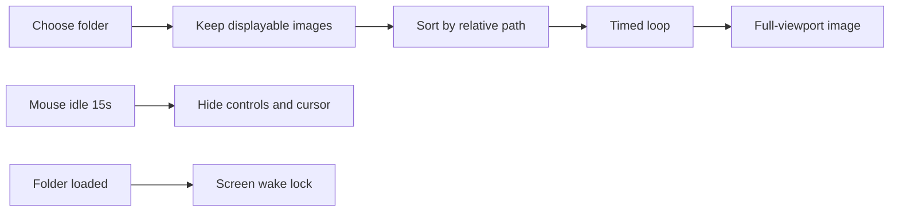

# Image Loop Slideshow

## Wake lock (yes, with limits)

Browsers cannot run arbitrary OS commands, but they **can** ask the platform not to dim or lock the screen via the [Screen Wake Lock API](https://developer.mozilla.org/en-US/docs/Web/API/Screen_Wake_Lock_API): `navigator.wakeLock.request("screen")`.

This is the right API for “load folder, F11, leave it running.”

**What it does**
- Prevents display dimming and screen lock while this tab is visible
- On typical Linux/Windows/macOS desktops, that also delays idle sleep because the session is treated as in use

**What it does not do**
- Does not survive lid-close, explicit Sleep, or aggressive power-save / low-battery policies
- Is released when the tab is hidden or the window is minimized; re-request on `visibilitychange`
- Requires a [secure context](https://developer.mozilla.org/en-US/docs/Web/Security/Secure_Contexts) (HTTPS or localhost). The live site already qualifies; `./start.sh` does too

**UI:** a **Keep screen awake** checkbox, on by default once a folder is loaded. Show a small status (active / unavailable / released). If `navigator.wakeLock` is missing or the request fails, keep the slideshow working and show a short hint that the OS may still sleep.

## Approach

Same pattern as [pixelZoom.html](pixelZoom.html): one HTML file at the repo root, inline CSS/JS, dark theme (`#1a1a1a` / `#60a5fa` / `#2563eb`), no libraries. Register it in [data.js](data.js).

A webpage cannot read a typed filesystem path. The user chooses a folder with a directory picker (`<input type="file" webkitdirectory>`), which works in Chrome, Firefox, and Safari. Nested files come through on `File.webkitRelativePath`; keep them.



## UX

**Landing:** title, short hint (choose a folder, F11 for fullscreen, mouse-idle hides chrome), **Choose folder** button, optional drag-and-drop of a directory where the browser provides it.

**After load:** black full-viewport stage. Image uses `object-fit: contain` (letterboxed, never cropped). Overlay chrome (top or bottom):

- Folder name + `n / total`
- Play / pause
- Prev / next
- Speed: range + numeric value, **seconds per image** (about 0.25–60, default **5**)
- Shuffle toggle (off by default; sequential by filename/path)
- Keep screen awake checkbox
- Choose another folder

**Idle hide:** any `mousemove` / `pointermove` / `keydown` / overlay click resets a 15s timer. After 15s with no mouse movement, fade out the overlay and set `cursor: none`. Moving the mouse brings chrome back. Keyboard still works while chrome is hidden.

**Keyboard:** Space play/pause, Left/Right prev/next. F11 stays the browser’s own fullscreen (no extra API required). Optional Fullscreen button via the Fullscreen API is fine as a convenience; Esc follows normal browser behavior.

**Empty / unsupported:** if the folder has no displayable images, stay on the landing screen with an error.

## Playback details

- Accept types the browser can show: `image/jpeg`, `png`, `gif`, `webp`, `avif`, `bmp`, `svg+xml`, plus matching extensions
- Sort by `webkitRelativePath` or `name`
- Advance with `setTimeout` (restart the timer when speed changes or the user skips)
- Wrap from last to first
- One object URL at a time (or current + next preload); revoke on change/unload so large folders do not leak
- Instant cut between images (no fade)

## Files

- **Create** [imageLoop.html](imageLoop.html) — picker, viewer, idle hide, wake lock
- **Update** [data.js](data.js) — append:

```js
{
  title: "Image Loop",
  description: "Load a folder of images and play them as a fullscreen loop",
  path: "imageLoop.html"
}
```

## Checks after implement

- Pick a folder with mixed files; only images appear, sorted, looping
- Speed slider actually changes interval; pause/next/prev work with chrome hidden
- Controls and cursor hide after 15s of no mouse movement and return on move
- With Keep screen awake on, `navigator.wakeLock` is held while the tab is visible and re-acquired after switching away and back
- F11 still works as normal browser fullscreen
