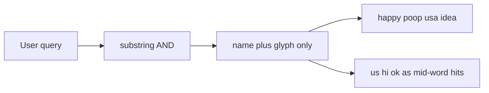

# Improve emoji search

## Why it is limited

The picker in [`emojiPicker.html`](emojiPicker.html) is not “bad at filtering.” It is searching a thin index with a blunt matcher.

**1. The dataset only has CLDR short names.** [`emojiData.js`](emojiData.js) was generated from [`wiki/raw/Full Emoji List, v17.0.md`](wiki/raw/Full%20Emoji%20List,%20v17.0.md) as `['char', 'name']` (1,918 rows). That Unicode chart is a vendor-image list; its last column is the **CLDR short name** (text-to-speech label), not search terms. Unicode’s actual search vocabulary is **CLDR keywords** in [`common/annotations/en.xml`](https://github.com/unicode-org/cldr/blob/main/common/annotations/en.xml) (plus derived annotations for flags). Those were never ingested.

The UI even documents this: “Search by CLDR short name.”

**2. People do not type those names.** Short names are descriptive (`face with tears of joy`, `pile of poo`, `folded hands`, `hundred points`, `flag: United States`). Everyday queries miss them:

- `happy` → 0 (misses nearly every smiling face)
- `poop` → 0 (`pile of poo` only)
- `lol` → lollipop, not the laugh face
- `pray` / `please` / `thanks` → prayer beads or nothing, not folded hands
- `usa` / `hello` / `idea` / `100` / `like` / `okay` → 0
- `smile` → only “cat with wry smile”, not grinning/smiling faces
- `:smile:` / `thumbsup` → 0 (no shortcodes)

CLDR keywords exist specifically for this (`lol`, `poop`, `+1`, `please`, `100`, `idea`, …).

**3. The matcher is substring-AND with no ranking.** Every query token must appear anywhere in `name + character`. No word boundaries, no aliases, no groups, results stay in chart order.

That causes both misses and junk hits:

- `us` → 72 rows (`shUShing`, `Unamused`, `naUSeated`)
- `hi` → 89 rows (`laugHIng`, `tHInking`)
- `ok` → `brOKen heart` (substring of “broken”)
- `yes` → `eYES` in “smiling eyes”
- `face` → 124 unranked faces

**4. Categories are not searchable.** The source chart has groups (`Smileys & Emotion`, `Animals & Nature`) and subgroups (`face-smiling`). They were dropped at generation time, so `animals` / `smileys` / `flags` do nothing.

## Approach

Keep the tool simple, offline, and in-browser. Do not add a runtime library. Fix the index, then the matcher.

**Data** (regenerate [`emojiData.js`](emojiData.js)):

- Keep the current 1,918-character set and display names.
- Join English CLDR keywords from `annotations/en.xml` and `annotationsDerived/en.xml`.
- Join group + subgroup from Unicode `emoji-test.txt` (same v17 set).
- Add a tiny extra alias map only where CLDR is still weak (e.g. `usa`/`america` for the US flag, GitHub-style `thumbsup` / `+1` if missing).
- Compact row shape, e.g. `['char', 'name', 'keywords...', 'Group', 'subgroup']`.
- Add a small reproducible build script (the original extract was a one-off shell snippet) so the file can be rebuilt when Unicode updates.

**Matcher** in [`emojiPicker.html`](emojiPicker.html):

- Tokenize the query; require each token to match a **word prefix** (so `grin` hits `grinning`, but `ok` does not hit `broken`, `us` does not hit `confused`).
- Search haystack = name + keywords + group + subgroup + aliases.
- Rank: name prefix/exact > name word > keyword > group/subgroup. Stable-sort so useful hits appear first.
- Strip the `⊛` new-emoji marker from search text.
- Update the subtitle/placeholder to say you can search by meaning, not only official names.

Leave copy, paging (200), and layout as they are.

## Files

- [`emojiData.js`](emojiData.js) — richer generated index
- [`emojiPicker.html`](emojiPicker.html) — word-prefix filter + ranking; copy of subtitle
- New `scripts/build-emoji-data.py` (or `.mjs`) — fetch/parse CLDR + emoji-test, emit `emojiData.js`
- [`data.js`](data.js) — optional one-line description tweak

## Checks after implement

Confirm these queries become useful:

- `happy`, `lol`, `poop`, `pray`, `thanks`, `idea`, `100`, `usa`, `hello` find the expected glyphs
- `ok` is OK-hand, not broken heart; `us` is not 72 mid-word hits
- `smile` ranks smiling faces above “cat with wry smile”
- `animals` / `flags` return those groups
- Empty query still shows the full list in Unicode order
