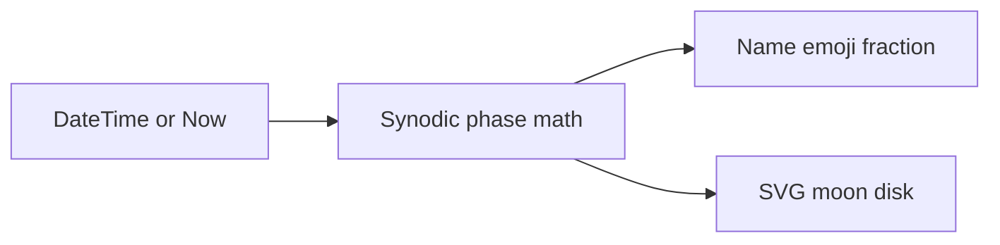

# Moon Phase Tool

## Approach

Add one self-contained page ([moonPhase.html](moonPhase.html)) plus a registry entry in [data.js](data.js), matching how other tools work (e.g. [copyX.html](copyX.html), [intervalTimers.html](intervalTimers.html)).

**Defaults:** current time on load with a live clock; optional date/time input to inspect other moments. Pure JS (no CDN) using a standard synodic-month approximation.

## Phase math (inline in the page)

Use the known new-moon epoch and mean synodic month (~29.530588853 days):

- `phase` in `[0, 1)` = fraction through the cycle from new moon
- Illuminated fraction ≈ `(1 - cos(2π × phase)) / 2` (0 = new, 1 = full)
- Map `phase` to one of eight names: New Moon, Waxing Crescent, First Quarter, Waxing Gibbous, Full Moon, Waning Gibbous, Last Quarter, Waning Crescent
- Also show the matching moon emoji (🌑–🌘)

Accuracy is good enough for a display tool (~hours), not precision astronomy.

## UI

Dark theme aligned with recent tools (`#1a1a1a` / `#60a5fa` accents, or the CSS-variable style from intervalTimers):

- Large **SVG moon disk** (~220px): lit hemisphere vs shadowed side driven by `phase` / illumination (waxing = light on the right, waning = light on the left). Draw via an SVG ellipse/clip for the terminator so the lit fraction is visually accurate.
- **Phase name** + emoji as the primary label
- **Illuminated fraction** as a percentage (e.g. `73% illuminated`) and optionally the cycle fraction (e.g. `0.73 through cycle`)
- Secondary line: local date/time being shown
- Controls: **Now** button (reset to live), date+time input for other moments
- While on “live” mode, refresh every minute (or on visibility) so the page stays current without a heavy animation loop



## Registration

Append to the `tools` array in [data.js](data.js):

```js
{
    title: "Moon Phase",
    description: "Current lunar phase with illuminated fraction and a visual moon disk",
    path: "moonPhase.html"
}
```

## Files

| Action | File |
|--------|------|
| Create | [moonPhase.html](moonPhase.html) |
| Update | [data.js](data.js) |

No README, build step, or shared layout changes.
